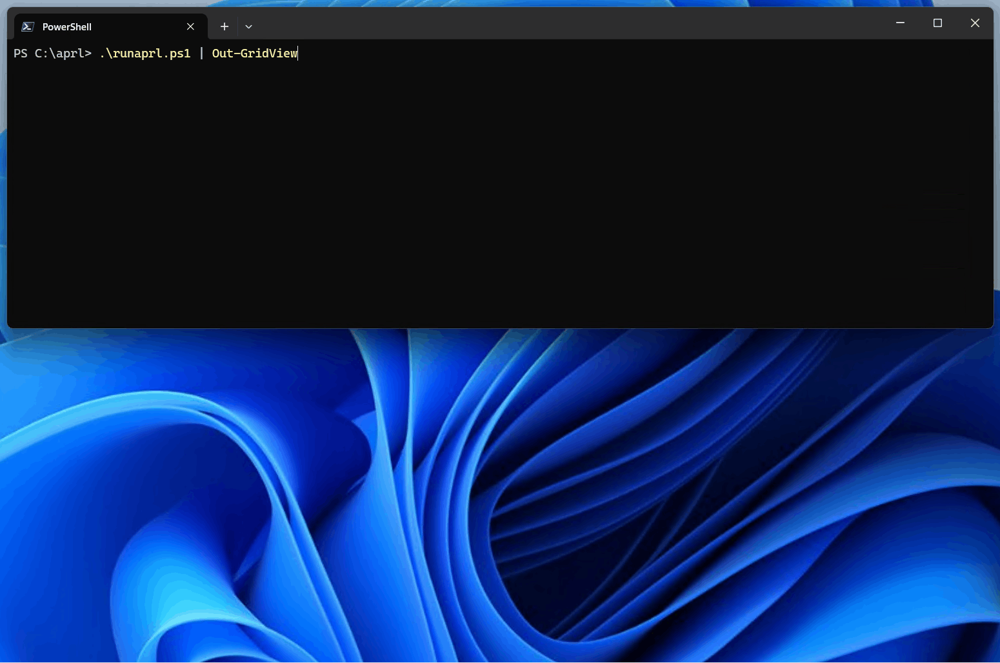

# APRL helper scripts

The helper scripts to utilize the [Azure Proactive Resiliency Library (APRL)](https://github.com/Azure/Azure-Proactive-Resiliency-Library). The scripts allow batch execution of the APRL's queries.

## Helper scripts

Three helper scripts have different purposes.

- **getaprl.ps1**: Downloads the APRL contents from the [APRL GitHub repository](https://github.com/Azure/Azure-Proactive-Resiliency-Library). After downloading, this script extracts Azure Resource Graph (ARG) queries, and stores it into the `queries` folder in the current directory. The `queries` folder will be created if it does not exist.

- **runaprl.ps1**: Executes the downloaded ARG queries in the `queries` folder against your Azure subscription.

    - You must have completed [Connect-AzAccount](https://learn.microsoft.com/en-us/powershell/module/az.accounts/connect-azaccount) and [Set-AzContext](https://learn.microsoft.com/en-us/powershell/module/az.accounts/set-azcontext) correctly before run this script.
    
    - This script requires [Az.ResourceGraph](https://www.powershellgallery.com/packages/Az.ResourceGraph), [Az.Accounts](https://www.powershellgallery.com/packages/Az.Accounts) and [Az.Resources](https://www.powershellgallery.com/packages/Az.Resources) modules. You can install those modules by the following command if you have not installed these modules.

        ```powershell
        Install-Module -Name 'Az.ResourceGraph', 'Az.Accounts', 'Az.Resources' -Repository 'PSGallery' -Scope AllUsers -Force
        ```

- **saveascsv.ps1**: Saves the outputs from `runaprl.ps1` as a CSV file. This is a script for convenience to save the output into a CSV file. The default output file path is `./results.csv`.

## Prerequisites

- One of the following PowerShell.
    - [Latest PowerShell](https://github.com/PowerShell/PowerShell) (Recommended)
    - Windows PowerShell 5.1
- The scripts tested on Windows, but the scripts may be run on other platforms as well. Feedback is welcome.

## Quick start

1. Download the APRL's contents onto your local filesystem. After running the following command, the APRL's ARG queries are stored in the `queries` folder in the current directory.

    ```powershell
    PS C:\aprl> .\getaprl.ps1
    ```

2. Execute the APRL's ARG queries in the `queries` folder, and save the result to the `./results.csv` file.

    ```powershell
    PS C:\aprl> .\runaprl.ps1 | .\saveascsv.ps1
    ```

## Usage examples

### getaprl.ps1

- **Example 1:** Download the APRL's contents onto your local filesystem.

    ```powershell
    PS C:\aprl> .\getaprl.ps1
    ```

### runaprl.ps1 and saveascsv.ps1

- **Example 1:** Execute the APRL's ARG queries without saving the result to a file.

    ```powershell
    PS C:\aprl> .\runaprl.ps1
    ```

- **Example 2:** Execute the APRL's ARG queries, then save the result to a CSV file using the standard PowerShell cmdlets.

    ```powershell
    PS C:\aprl> .\runaprl.ps1 | ConvertTo-Csv -NoTypeInformation | Out-File -LiteralPath './results.csv' -Encoding utf8 -Force
    ```

- **Example 3:** Execute the APRL's ARG queries, then save the result to a CSV file using the `saveascsv.ps1` script. The `saveascsv.ps1` script is convenient (less typing) than use standard PowerShell cmdlets. 

    ```powershell
    PS C:\aprl> .\runaprl.ps1 | .\saveascsv.ps1
    ```

- **Example 4:** Execute the APRL's ARG queries, then showing the result in a grid view. This is convenient for interacting with the results using UI, or copy and paste to Excel, etc.

    ```powershell
    PS C:\aprl> .\runaprl.ps1 | Out-GridView
    ```

    

    **NOTE:** The [Out-GridView](https://learn.microsoft.com/en-us/powershell/module/microsoft.powershell.utility/out-gridview) cmdlet available on Windows Desktop only. A similar cmdlet for cross-platform version is provided by the [ConsoleGuiTools](https://www.powershellgallery.com/packages/Microsoft.PowerShell.ConsoleGuiTools) module in the PowerShell Gallery.

## License

Copyright (c) 2023-present Takeshi Katano. All rights reserved. This software is released under the [MIT License](https://github.com/tksh164/aprl-helper-scripts/blob/main/LICENSE).

Disclaimer: The codes stored herein are my own personal codes and do not related my employer's any way.
